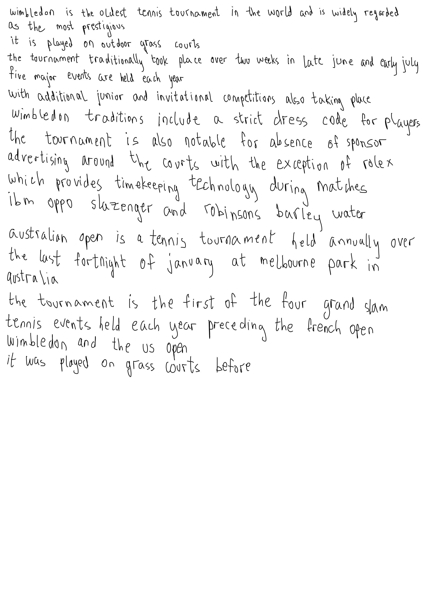

# Handwritten Text Recognition

C++ handwritten text recognition pipeline for scanned note images. The project combines line segmentation, connected-component analysis, neural letter recognition, bigram handling, and dictionary-based spell correction to turn handwritten page images into plain text.



## What it does

- Segments handwritten pages into text lines using an image-processing pipeline based on strip connections.
- Extracts connected components and classifies whether a component represents one letter or a two-letter bigram.
- Runs exported Keras models from C++ with `frugally-deep`.
- Uses a JamSpell language model and a word dictionary to improve recognition output.
- Supports debug output for inspecting intermediate segmentation and recognition steps.

## Pipeline

```text
input image
  -> line segmentation
  -> connected-component extraction
  -> one-letter / bigram decision
  -> neural letter prediction
  -> word assembly
  -> optional dictionary correction
  -> text output
```

## Tech Stack

- C++17
- OpenCV
- CMake
- frugally-deep for running exported neural-network models in C++
- JamSpell for spell correction
- nlohmann/json, Eigen, FunctionalPlus through the model inference stack

## Repository Layout

```text
.
|-- images/          # handwritten input examples
|-- include/         # image utilities and line segmentation code
|-- model/           # exported recognition models and JamSpell language model
|-- out/             # generated recognition outputs
|-- dictionary/      # English word dictionary used by correction step
|-- jamspell/        # local JamSpell integration
|-- contrib/         # third-party support libraries
`-- main.cpp         # recognition pipeline and CLI entry point
```

## Build

```bash
mkdir build
cd build
cmake ..
cmake --build .
```

## Usage

Recognize one image:

```bash
./main ../images/1.png dictionary
```

Recognize one image and keep debug artifacts:

```bash
./main ../images/1.png dictionary debug
```

Recognize all images in a directory:

```bash
./main ../images
```

Outputs are written to `out/`. Files ending in `_dictionary.txt` include dictionary/spell-correction post-processing.

## Related Project

The neural letter models used here are trained in the companion [Letters Recognition Models](../letters) project, which builds the synthetic/processed letter datasets, trains the CNN classifiers, and exports models for use in this C++ recognizer.
